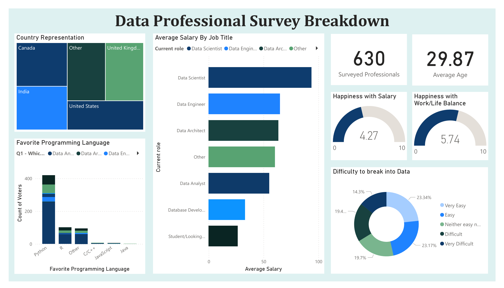

# Data Professionals Survey

### Overview 
This project presents a Power BI dashboard that analyzes the survey data of data professionals from various regions. The dashboard provides insights into different aspects of the data profession, including roles, salaries, satisfaction with work/life balance and generally how hard it was for them to get into Data. 

### Data Source
The survey was conducted by Alex the Analyst in September 2022. The raw data is available in the `survey_data.xlsx` file and includes responses from 630 participants worldwide.

### Data Cleaning and Transformation
Before creating the dashboard, the raw survey data underwent several cleaning and transformation steps to ensure accuracy and usability. Here are the key steps involved:

1. **Handling Missing Values**: - Missing values in critical columns such as `Job Role`, `Salary`, and `Experience Level` were identified and handled using appropriate techniques like imputation or removal of incomplete records. 

2. **Standardizing Formats**: - Data formats for columns such as `Salary`, `Experience`, and `Work/Life Balance` were standardized for consistency. For example, salaries were converted to a common currency, and experience levels were categorized uniformly. 

3. **Creating Calculated Columns**: - New columns were created to provide additional insights. For instance, a `Salary Range` column was derived from the salary data, and a `Work/Life Balance Score` was calculated based on survey responses. 
4. **Data Filtering**: - Irrelevant or outlier data points were filtered out to focus the analysis on the most representative data. For example, work roles and favorite programming languages columns were simplified by adding all but the main options in the group Other. 

### Dashboard
The Power BI dashboard created for this project provides a comprehensive visualization of the survey data, offering key insights into the data profession. The dashboard is divided into several interactive sections, each designed to highlight different aspects of the survey data.

### Valuable Insights
The analysis of the survey data yielded several valuable insights into the data profession:
**Job Role Popularity**:
- Data Analyst and Data Scientist roles were the most common among the respondents. These roles also showed a wide range of experience levels and salaries, indicating diverse career paths within these positions.

**Work/Life Balance Satisfaction**:
- The average Work/Life Balance Score was 5.75, indicating that while many respondents are satisfied, there is still room for improvement in achieving better work/life balance within the data profession.

**Challenges in Entering the Data Profession**:
- A significant number of respondents found it moderately difficult to transition into data roles, citing lack of experience and competition as primary barriers. This highlights the importance of practical experience and skill-building for aspiring data professionals.

**Favorite Programming Language**:
- A significant majority of respondents preferred Python, indicating that this language is fundamental for data-oriented roles.

**Salary & Job Title**:
- **Data Scientist**: Data Scientists make the most, earning almost 40% more on average than the second highest position, Data Engineer.
- **Geographic Variation**: Salaries vary significantly depending on geographic location, with notable differences observed across regions.