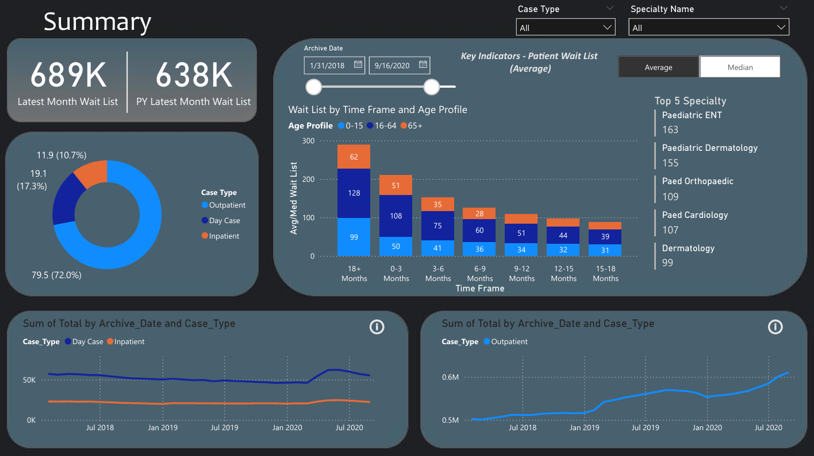
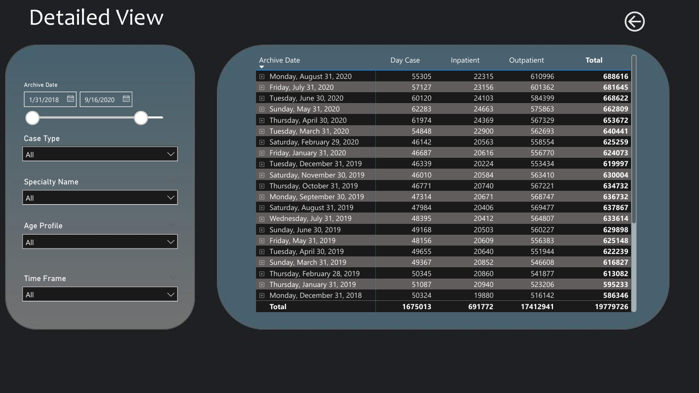

# Healthcare Data Visualization

### Dashboard Preview

### Overview
This project presents a Power BI dashboard designed to optimize patient waitlists for inpatient and outpatient services. With the help of Power BI, healthcare providers can gain vital information to streamline patient flow, allocate resources effectively, and enhance the quality of care provided. 

### Data Source
Detailed healthcare datasets were gathered from Kaggle, They cover (but not limited to): admission and release timestamps, age, adult status, specialty visits (like cardiology, general surgery, psychology), and duration of stays. These datasets were split into two separate tables for inpatient and outpatient records from 2018 to 2021.

### Data Cleaning and Transformation
Before creating the dashboard, the raw healthcare data underwent several cleaning and transformation steps:

1. **Data Gathering**: 
   - Imported the data using Power BI's simple folder connector.
   - Data from inpatient and outpatient records were merged into a single table, `All_data`, with a new column `case_type` added to the outpatient table for consistency.

2. **Data Transforming and Modelling**: 
   - Performed data transformations in Power Query to ensure correct data types, assess data volume, and rectify redundant values.
   - Standardized data formats and ensured coherence across the dataset. e.g: Duplicate age groups of 0-15 were merged into one. 

3. **Table Relations**:
   - Created a specialty table categorizing patient specialties into distinct groups.
   - Established relations between `All_data` and the `Mapping_Specialty` table based on the `Speciality` column.

### Layout and Designing

1. **Dashboard Design**:
   - The main page includes a title and Key Performance Indicators (KPIs), showcasing the current year’s total waitlist and a comparative view with the previous year.
   - Visual elements include a pie chart for case type distribution, an age profile bar chart, and a filtered display of the top 5 specialties.
   - A monthly trend analysis of inpatient and outpatient cases categorized by case type from 2018 to 2021.

2. **Background Layout**:
   - The background design was created in PowerPoint using shapes and colors extracted from an appealing dashboard design found online.

### Analysis and Visualization
Several pivotal questions guided the exploration of the dataset:

1. **Comparison of Current and Previous Year’s Waitlist**:
   - The DAX measures calculated the previous and current year’s waitlist, revealing an increase to over 700,000 individuals in the current year from 640,000 the previous year.

2. **Hospital Stay Duration by Age Group**:
   - A stacked bar chart showed that the age group 16–64 years represents the majority of admitted patients across different stay durations.

3. **Top 5 Waitlisted Specialties**:
   - Analysis revealed a notable trend towards pediatric-focused specialties, with Pediatric Dermatology and Pediatric ENT at the top of the list.

4. **Monthly Trends by Case Type**:
   - A line graph depicted relatively stable figures for day-case and inpatient cases, with a substantial upward trend in outpatient cases from 2018 to 2021.

### Conclusion
The analysis unveiled key insights into healthcare trends. The data showcased a significant surge in outpatient cases over the years, indicating a shift towards non-hospital-stay treatments. Pediatric specialties emerged as focal points, with high waitlists, emphasizing the need for specialized care for children. Factors like technological advancements and patient preferences likely drive the rise in outpatient care. Understanding these trends is vital for healthcare providers to meet evolving patient needs effectively and allocate resources efficiently.
